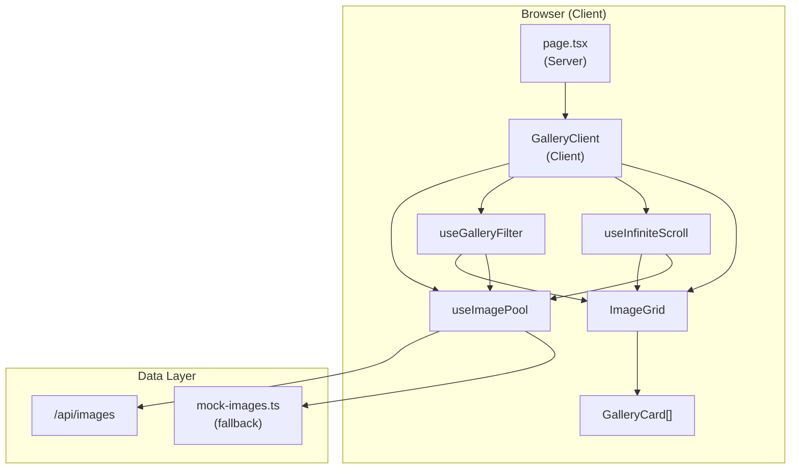

# Image Gallery SPA – Architecture

**Last updated:** February 28, 2026

## Overview

The Image Gallery is a client-side Single-Page Application built with Next.js 16, React 19, and TypeScript. It displays a masonry-style grid of placeholder images with hashtags, supports infinite scroll, and keyword filtering.

## High-Level Architecture



## Component Hierarchy

```
page.tsx (Server)
└── GalleryClient (Client)
    ├── HashtagFilter
    ├── ImageGrid
    │   └── GalleryCard (×N)
    ├── Lightbox
    ├── Footer
    └── BackToTop
```

## Data Flow

1. **Initial Load**: `GalleryClient` mounts → `useImagePool` fetches from `/api/images` (or mock on error) → `useInfiniteScroll` slices first 12 from pool → `ImageGrid` renders `GalleryCard`s.
2. **Infinite Scroll**: IntersectionObserver watches a sentinel div → when visible, `displayCount` increases → more images sliced from filtered pool.
3. **Hashtag Filter**: User clicks hashtag → `useGalleryFilter` sets `activeHashtag` → filter function updates → `useInfiniteScroll` re-filters pool → slice reflects filtered set.

## Tech Stack

| Layer     | Technology                           |
| --------- | ------------------------------------ |
| Framework | Next.js 16 (App Router)              |
| UI        | React 19, Tailwind CSS               |
| Language  | TypeScript                           |
| Images    | placehold.co (mock)                  |
| State     | React useState/useMemo               |
| Quality   | ESLint, Prettier, Vitest, Playwright |

## File Structure

```
src/
├── app/
│   ├── page.tsx              # Home route (server)
│   ├── layout.tsx
│   ├── globals.css
│   ├── components/
│   │   └── GalleryClient.tsx # Main client orchestrator
│   └── api/
│       └── images/
│           └── route.ts      # GET images (Prisma)
├── components/
│   ├── GalleryCard.tsx       # Single image + hashtags
│   ├── ImageGrid.tsx        # Masonry grid layout
│   ├── HashtagFilter.tsx     # Active filter + clear
│   ├── Lightbox.tsx         # Full-screen viewer
│   ├── BackToTop.tsx        # Scroll-to-top button
│   └── Footer.tsx           # Footer branding
└── lib/
    ├── constants.ts         # Copy, PAGE_SIZE, etc.
    ├── utils.ts             # cn()
    ├── db.ts                # Prisma client
    ├── data/
    │   └── mock-images.ts   # placehold.co + hashtags
    └── hooks/
        ├── use-gallery-filter.ts
        ├── use-image-pool.ts      # Fetch API or mock
        ├── use-infinite-scroll.ts
        ├── use-masonry-columns.ts
        └── use-responsive-columns.ts
```

## Testing Strategy

- **Unit (Vitest + RTL):** Hooks, components, utils, mock data. Run `npm run test`.
- **E2E (Playwright):** Critical user flows (gallery load, filter, lightbox). Run `npm run test:e2e`.
- **Performance:** `content-visibility: auto` on cards for off-screen rendering optimization.

## API & Database

- **GET /api/images** – Returns all images from MySQL (Prisma). Falls back to mock if DB unavailable.
- **Prisma + MySQL** – `Image` and `Hashtag` models. Seed: `npm run db:seed`.

## Deployment

- **Docker**: `docker compose up -d` – App + MySQL. See [docs/DEPLOY.md](./DEPLOY.md).
- **Vercel**: Add `DATABASE_URL` (PlanetScale/Neon). See vercel.json.
- **Ubuntu + PM2**: See ecosystem.config.cjs and [docs/DEPLOY.md](./DEPLOY.md).
