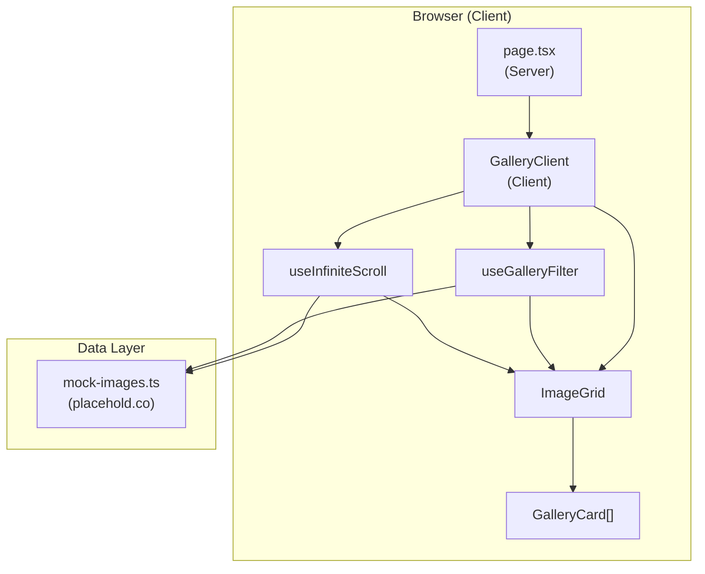

# Image Gallery SPA – Architecture

## Overview

The Image Gallery is a client-side Single-Page Application built with Next.js 16, React 19, and TypeScript. It displays a masonry-style grid of placeholder images with hashtags, supports infinite scroll, and keyword filtering.

## High-Level Architecture



## Component Hierarchy

```
page.tsx (Server)
└── GalleryClient (Client)
    ├── HashtagFilter
    └── ImageGrid
        └── GalleryCard (×N)
```

## Data Flow

1. **Initial Load**: `GalleryClient` mounts → `useInfiniteScroll` fetches first 12 images from mock pool → `ImageGrid` renders `GalleryCard`s.
2. **Infinite Scroll**: IntersectionObserver watches a sentinel div → when visible, `displayCount` increases → more images sliced from filtered pool.
3. **Hashtag Filter**: User clicks hashtag → `useGalleryFilter` sets `activeHashtag` → filter function updates → `useInfiniteScroll` re-filters pool → `displayCount` unchanged, slice reflects filtered set.

## Tech Stack

| Layer     | Technology               |
| --------- | ------------------------ |
| Framework | Next.js 16 (App Router)  |
| UI        | React 19, Tailwind CSS   |
| Language  | TypeScript               |
| Images    | placehold.co (mock)      |
| State     | React useState/useMemo   |
| Quality   | ESLint, Prettier, Vitest |

## File Structure

```
src/
├── app/
│   ├── page.tsx              # Home route (server)
│   ├── layout.tsx
│   ├── globals.css
│   └── components/
│       └── GalleryClient.tsx # Main client orchestrator
├── components/
│   ├── GalleryCard.tsx       # Single image + hashtags
│   ├── HashtagFilter.tsx     # Active filter + clear
│   └── ImageGrid.tsx         # Masonry grid layout
└── lib/
    ├── constants.ts          # Copy, PAGE_SIZE, etc.
    ├── utils.ts              # cn()
    ├── data/
    │   └── mock-images.ts    # placehold.co + hashtags
    └── hooks/
        ├── use-gallery-filter.ts
        └── use-infinite-scroll.ts
```

## Future Extensions (Optional)

- **API Route**: Replace mock pool with `/api/images` fetching from MySQL via Prisma.
- **Docker**: Add Dockerfile and docker-compose for app + MySQL.
- **Deploy**: Vercel, or Ubuntu Server with PM2.
